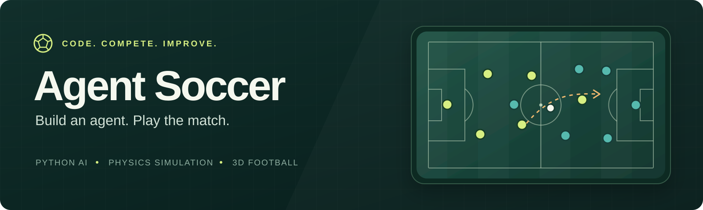
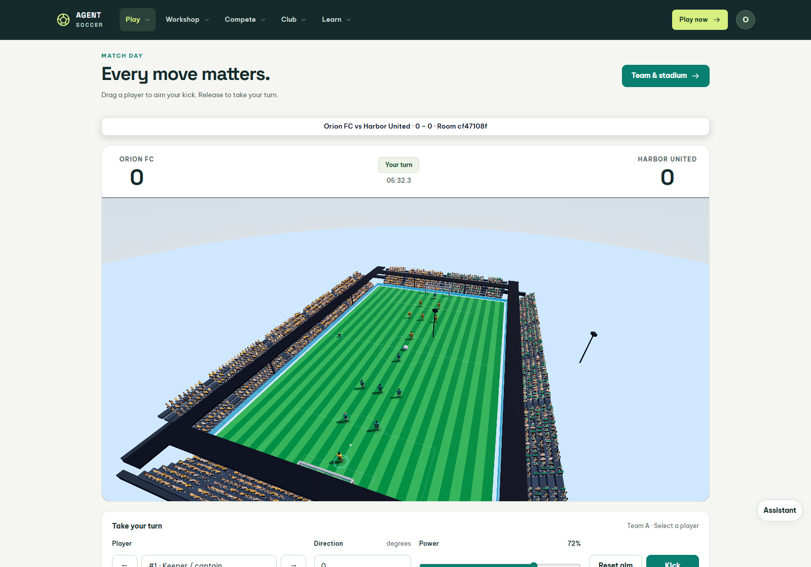
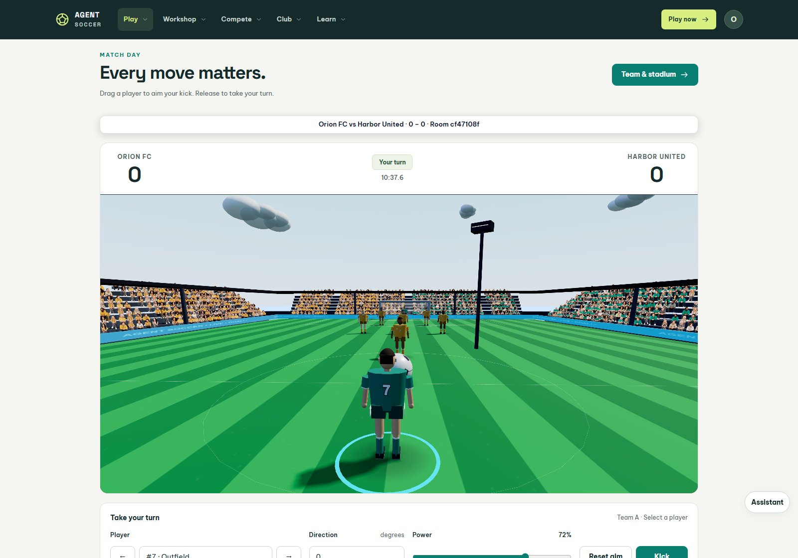
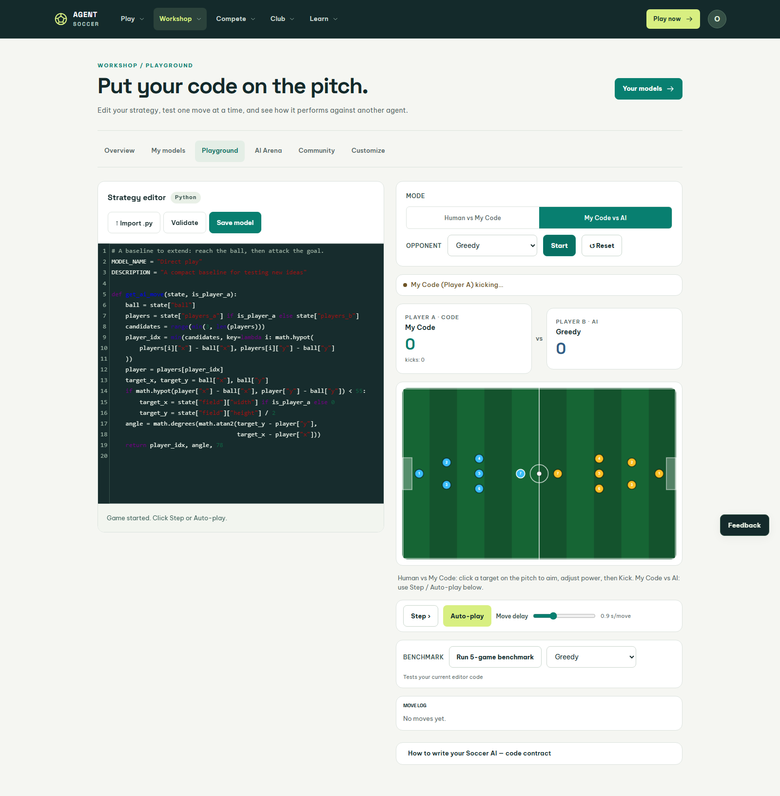
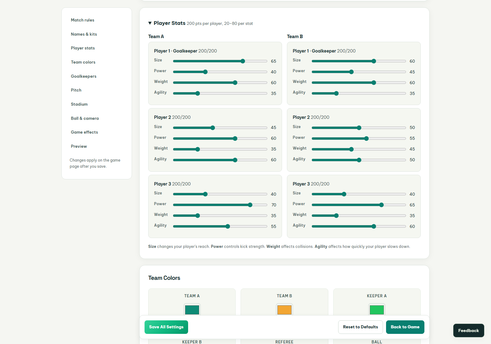
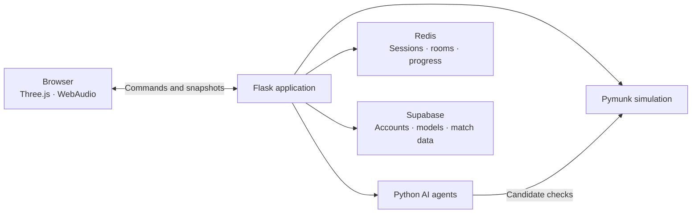

# Agent Soccer

**A soccer game and Python AI playground, in your browser.** Build a strategy, tune your squad, and watch it compete on a 3D pitch. Agent Soccer combines turn-based controls with server-side physics, online matches, and tools for comparing your agents.

**Python · Flask · Pymunk · Three.js · WebAudio**

[Quick start](#quick-start) · [Build an agent](#build-an-agent) · [AI catalog](#ai-catalog) · [Documentation](#documentation) · [Demo](https://drag-soccer-with-agent.onrender.com/)



*An actual local 7v7 match. The browser renders the stadium; the server resolves each kick.*

## What you can do

| | Experience |
| --- | --- |
| **Play** | Pull a player back, aim, and release. Play against an AI, take turns locally, or watch AI vs AI. Teams support 1–11 players. |
| **Build** | Write Python in the AI Playground, validate your strategy, save custom models, and work through seven guided lessons. |
| **Customize** | Allocate player stats, choose formations and kits, and set the stadium's crowd palette and environment. |
| **Compete** | Compare agents in the Arena, run tournaments, submit models to the model leaderboard, or play ranked human matches. |
| **Connect** | Create online rooms, invite friends, join clans, and use match chat or opt-in voice chat. |
| **Watch** | Spectate active matches, replay tournament games, and share automatically detected highlights. |

The 3D views draw when the scene changes and pause while hidden or offscreen. Camera visibility filtering reduces crowd work. Graphics settings include Auto, 1080p, 1440p, and 4K; the drawing buffer is bounded by GPU and allocation limits. Stadium ambience and match effects use synthesized WebAudio sound.

<details>
<summary><strong>Explore the player camera, AI editor, and team builder</strong></summary>

### Player camera



### AI Playground



### Team builder



These screenshots come from the running application. [Capture them again](tools/browser/capture_readme.py) after installing the browser verification dependencies below.

</details>

## Quick start

Use **Python 3.11+** and Git. Local development can use in-memory storage with `DEV_MODE=1`; external service keys are optional for this mode.

```bash
git clone https://github.com/NghiemNgocDuc/Drag_Soccer_with_Agent.git
cd Drag_Soccer_with_Agent
```

### Windows · PowerShell

```powershell
python -m venv .venv
.\.venv\Scripts\python.exe -m pip install -r requirements.txt
Copy-Item .env.example .env
$env:DEV_MODE = "1"
.\.venv\Scripts\python.exe app.py
```

### macOS / Linux

```bash
python3 -m venv .venv
source .venv/bin/activate
python -m pip install -r requirements.txt
cp .env.example .env
DEV_MODE=1 python app.py
```

Open **[localhost:5000](http://localhost:5000)**. Choose **Log in → Try the demo account → Use demo details → Sign in**, then open the Workshop to create an agent. Keep optional integration keys empty for a standalone local session.

### Play your first match

1. Open **Play** and choose Human vs AI, Human vs Human, or AI vs AI.
2. Choose a squad and match settings. The default team size is seven.
3. Pull a legal player backward and release to kick, or use the direction and power controls.

| Action | Keyboard |
| --- | --- |
| Aim | Left / right arrows |
| Adjust power | Up / down arrows |
| Fine adjustment | Shift + arrow |
| Switch legal players | Q / Shift + Q |
| Kick | Enter / Space while using the pitch |
| Cancel aiming | Escape |

Human vs AI gives you captain control. Local Human vs Human and online play allow selection from the active player's roster. Matches end at the selected goal limit or match time; tied timed matches progress through extra time and a shootout.

### Give each player a role

Each player has a **200-point budget** across four stats, with values from 20 to 80 in the team builder.

| Stat | Effect on physics |
| --- | --- |
| **Size** | Body radius and contact reach |
| **Power** | Kick launch speed |
| **Weight** | Body mass and collision response |
| **Agility** | Stopping resistance and settling after movement |

See [player controls](docs/player-controls.md) and [physics](docs/physics.md) for the rules and implementation details.

## Build an agent

Open the **AI Playground** from the Workshop. Your strategy implements one function:

```python
get_ai_move(state, is_player_a) -> (player_index, angle_degrees, power)
```

This starter strategy chooses an eligible player nearest the ball and launches toward it:

```python
def get_ai_move(state, is_player_a):
    players = state["players_a"] if is_player_a else state["players_b"]
    ball = state["ball"]
    eligible = range(min(3, len(players)))
    idx = min(eligible, key=lambda i:
        (players[i]["x"] - ball["x"]) ** 2
        + (players[i]["y"] - ball["y"]) ** 2)
    player = players[idx]
    angle = math.degrees(math.atan2(
        ball["y"] - player["y"],
        ball["x"] - player["x"],
    ))
    return idx, angle, 80.0
```

`math`, `random`, and `copy` are supplied by the runner; this example needs no imports. Angles use server coordinates: **0° points right, 90° points down**. Power ranges from **0 to 100**. Read dimensions from `state["field"]` when developing field-aware strategies.

The current uploaded-model runner limits player selection to **indices 0–2**, including in larger squads. Use the editor's validation, step, autoplay, and benchmark controls to test your code and compare it against built-in agents before saving it to My Models.

The contract and execution settings live in [user_models/runner.py](user_models/runner.py). Uploaded Python runs with restricted globals; its thread-based timeout does not forcibly terminate executing code.

## AI catalog

Twelve built-in agents offer different ways to choose a kick. The supported IDs are defined in [app.py](app.py).

| Agent ID | Approach |
| --- | --- |
| `greedy` | Reachable-player selection with coarse and fine physics search |
| `genetic_fuzzy` | Fixed Mamdani fuzzy rules with physics verification |
| `potential_field` | Goal attraction, obstacle repulsion, and space control |
| `voronoi` | Distance-weighted spatial control |
| `a2c_lite` | Handcrafted value and advantage search |
| `expectimax` | Candidate kicks evaluated against weighted opponent replies |
| `adaptive_learner` | Persistent epsilon-greedy Q-table, trained through explicit self-play |
| `goalnet_gat` | Handcrafted attention, centrality, and threat scoring |
| `edms` | Space, pass, and threat heuristics |
| `team_coordinated` | Kick selection using team spacing and possession value |
| `hybrid_ensemble` | Region-based expert selection and fixed-weight voting |
| `langchain` | Optional LLM candidates with physics checks and a local fallback |

Built-in agents share a fast tactical shortlist for shots, open passes, clearances, and support. Their searches stop after **120 ms or 12 physics predictions** by default, keeping the best completed move; the Q-table learner retains its immediate lookup. Each agent refines the shortlist while time remains. The advantage and attention agents use handcrafted scoring. The LLM agent uses its local strategy in the default fast mode.

Live requests use four worker slots per process and return a legal tactical fallback when busy. Built-in physics searches stop cooperatively; arbitrary uploaded Python retains its slot until execution finishes. See [AI responsiveness](docs/ai-responsiveness.md) for tuning, timing measurements, and tradeoffs.

## Architecture

The browser sends commands and plays back authoritative trajectories. **Pymunk handles planar physics; Three.js provides the 3D presentation.** Online match state and voice signaling use HTTP polling. Voice audio travels directly between peers over WebRTC.



| Layer | Technology |
| --- | --- |
| Application | Python, Flask, Gunicorn |
| Simulation | Pymunk / Chipmunk2D |
| Browser | Three.js, vanilla JavaScript, shared CSS, local fonts |
| Editor | CodeMirror with Python mode |
| Shared state | Redis, with a local in-memory fallback |
| Persistence and authentication | Supabase; optional Clerk integration |
| Audio and voice | WebAudio; opt-in WebRTC with STUN |
| Deployment | Render configuration in `render.yaml` |

### Repository layout

```text
app.py / config.py   Flask entry point and configuration
game/               Match sessions and snapshots
models/             Physics and built-in agents
user_models/        Custom Python validation and execution
services/           Analytics, tutorials, and integrations
db/                 Persistence modules, SQL schema, and migrations
templates/          Pages grouped by feature
static/             Styles, game/UI scripts, textures, and vendor assets
tests/              Backend and frontend regression suites
tools/              Test runner, browser checks, and benchmarks
docs/               Reference guides, diagrams, and README images
```

See [project layout](docs/project-layout.md) for folder responsibilities and entry points.

## Verification

Use the virtual environment from the quick start. Test tooling is installed separately from the application dependencies:

```bash
python -m pip install pytest
python tools/run_tests.py
```

The runner disables external integrations before importing the application and forwards pytest arguments. For example:

```bash
python tools/run_tests.py tests/backend/test_ranked.py
```

Frontend unit tests require **Node.js 18+**. On macOS / Linux:

```bash
node --test tests/frontend/*.mjs
```

On Windows PowerShell:

```powershell
$frontendTests = Get-ChildItem tests/frontend -Filter *.mjs
node --test $frontendTests.FullName
```

Browser checks require Playwright and Chromium:

```bash
python -m pip install playwright
python -m playwright install chromium
python tools/browser/verify_frontend.py
```

On Windows, substitute `.\.venv\Scripts\python.exe` for `python` if the environment is not activated. Focused browser checks cover controls, online matches, sound, camera visibility, and rendering. Commands and measurement limits are documented in [tools/README.md](tools/README.md).

## Deployment

[render.yaml](render.yaml) defines the Render service and Gunicorn entry point. For production:

- Set `DEV_MODE=0` and generate a `SECRET_KEY`.
- Configure authentication and Supabase credentials, including `SUPABASE_SERVICE_KEY`.
- Configure shared Redis with `UPSTASH_REDIS_URL` so workers use the same rooms and sessions.
- Set `SITE_URL` to the public HTTPS URL for account links.
- Apply [the SQL schema](db/sql/schema.sql) and the relevant [feature migrations](db/sql/migrations/) when using Supabase.

Core integration settings are listed in [.env.example](.env.example). Email, analytics, research, and LLM integrations are optional; the LLM agent also reads `OPENAI_API_KEY` and `OLLAMA_HOST`. Voice currently uses STUN without a TURN relay, so some restrictive networks cannot establish a peer connection. See [online play](docs/online-play.md) for deployment and connection details.

## Documentation

| Guide | Covers |
| --- | --- |
| [AI responsiveness](docs/ai-responsiveness.md) | Bounded thinking, team tactics, timing results, and verification |
| [Gameplay smoothness](docs/gameplay-smoothness.md) | Synchronized motion, interpolation, camera timing, and replay transitions |
| [Physics](docs/physics.md) | Simulation rules, contacts, resistance, and tuning |
| [Players and controls](docs/player-controls.md) | Input rules, player models, and turn handling |
| [Online play](docs/online-play.md) | Rooms, matchmaking, replay synchronization, and verification |
| [Frontend](docs/frontend-design.md) | Shared page shell, responsive layout, and browser checks |
| [Stadium experience](docs/stadium-experience.md) | Audience rendering and synthesized match audio |
| [Analytics](docs/analytics.md) | Match analysis and reports |
| [Project layout](docs/project-layout.md) | Folder map and development commands |
| [Vendored assets](docs/vendoring.md) | Local libraries, fonts, and third-party notices |

Built by **Ngoc Duc Nghiem** · [@NghiemNgocDuc](https://github.com/NghiemNgocDuc)
